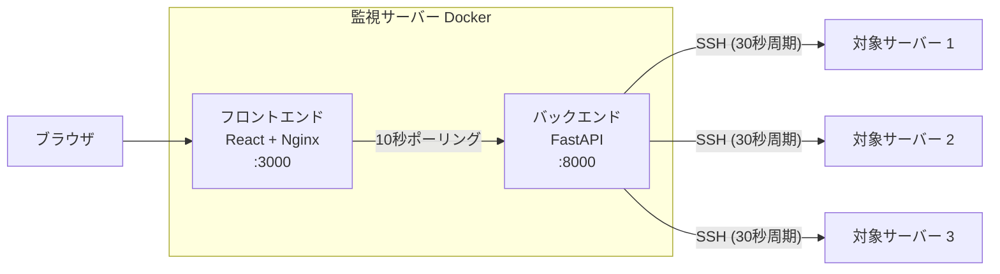

# 社内サーバー利用状況ダッシュボード

社内ネットワーク上の Ubuntu/Debian サーバー群の利用状況をリアルタイムに可視化する Web ダッシュボード。CPU、メモリ、ディスク、GPU、tmux セッションをユーザー単位で監視できます。

## スクリーンショット

> TODO: スクリーンショットを追加

## アーキテクチャ



- 監視サーバー上の Docker で バックエンド（FastAPI :8000）とフロントエンド（Nginx :3000）が動作
- バックエンドは SSH で複数の対象サーバー（Ubuntu/Debian）に接続
- フロントエンドは 10 秒ごとにバックエンド API をポーリング
- バックエンドは 30 秒周期で SSH 経由で対象サーバーの情報を収集
- データはインメモリで管理（データベース不使用）

## 技術スタック

| レイヤー | 技術 | 用途 |
|---------|------|------|
| バックエンド | Python 3.14 / FastAPI | API サーバー |
| バックエンド | asyncssh | 非同期 SSH 接続 |
| バックエンド | Pydantic v2 | データモデル・バリデーション |
| バックエンド | uv | パッケージマネージャ |
| フロントエンド | React 19 / TypeScript | UI |
| フロントエンド | React Router 7 | ルーティング |
| フロントエンド | TanStack Query | データフェッチ・ポーリング |
| フロントエンド | Tailwind CSS 4 | スタイリング |
| フロントエンド | Orval | OpenAPI → API クライアント自動生成 |
| フロントエンド | pnpm | パッケージマネージャ |
| インフラ | Docker + docker-compose | コンテナ化・デプロイ |
| インフラ | Nginx | 静的配信 + リバースプロキシ |
| テスト | Playwright | E2E テスト |

## 必要要件

- Docker / Docker Compose
- 監視対象サーバーへの SSH 接続用の鍵ペア
- 監視対象サーバーに `monitor` ユーザーが作成済みであること

## クイックスタート（Docker）

### 1. 設定ファイルの準備

```bash
cp config.yaml.example config.yaml
```

`config.yaml` を編集し、監視対象サーバーの情報を記入:

```yaml
servers:
  - name: "server-1"
    host: "192.168.1.10"
    ssh_user: "monitor"
```

### 2. SSH 鍵の準備

監視用の SSH 鍵ペアを生成:

```bash
ssh-keygen -t ed25519 -f ~/.ssh/server_monitor_key -N ""
```

監視対象サーバーに公開鍵を配布:

```bash
ssh-copy-id -i ~/.ssh/server_monitor_key.pub monitor@<対象サーバーIP>
```

### 3. 起動

```bash
docker compose up -d
```

ブラウザで http://localhost:3000 にアクセス。

## 開発環境セットアップ

### バックエンド

```bash
cd backend
uv sync          # 依存関係インストール
uv run uvicorn server.main:app --reload --host 0.0.0.0 --port 8000
```

### フロントエンド

```bash
cd frontend
nvm use          # Node.js バージョン切り替え
pnpm install     # 依存関係インストール
pnpm dev         # 開発サーバー起動 (http://localhost:5173)
```

## 監視対象サーバーの追加

1. 対象サーバーに `monitor` ユーザーを作成:
   ```bash
   sudo useradd -r -s /bin/bash monitor
   ```

2. SSH 公開鍵を配布:
   ```bash
   ssh-copy-id -i ~/.ssh/server_monitor_key.pub monitor@<新サーバーIP>
   ```

3. `config.yaml` にサーバー情報を追加:
   ```yaml
   servers:
     # ... 既存サーバー
     - name: "new-server"
       host: "192.168.1.XX"
       ssh_user: "monitor"
   ```

4. バックエンドを再起動（Docker の場合）:
   ```bash
   docker compose restart backend
   ```

## API ドキュメント

バックエンド起動後、以下の URL で Swagger UI を確認できます:

- Swagger UI: http://localhost:8000/docs
- ReDoc: http://localhost:8000/redoc

## 設計書

設計書は `docs/design/` 配下に格納しています。エントリポイントは [project-structure.md](docs/design/project-structure.md) です。

| ファイル | 内容 |
|---------|------|
| [project-structure.md](docs/design/project-structure.md) | プロジェクト構成・技術スタック |
| [api.md](docs/design/api.md) | API エンドポイント定義 |
| [data-model.md](docs/design/data-model.md) | データモデル設計 |
| [backend.md](docs/design/backend.md) | バックエンド設計 |
| [frontend.md](docs/design/frontend.md) | フロントエンド設計 |
| [config.md](docs/design/config.md) | 設定ファイル設計 |
| [openapi.md](docs/design/openapi.md) | OpenAPI 定義方針 |
| [docker.md](docs/design/docker.md) | Docker 設計 |
| [e2e-testing.md](docs/design/e2e-testing.md) | E2E テスト設計 |

## トラブルシューティング

### SSH 接続エラー

```
Permission denied (publickey)
```

- `monitor` ユーザーの `~/.ssh/authorized_keys` に公開鍵が登録されているか確認
- SSH 鍵のパーミッション: 秘密鍵は `600`、`.ssh` ディレクトリは `700`
- `config.yaml` の `ssh_key_path` が正しいパスを指しているか確認

### ポート競合

```
Bind for 0.0.0.0:3000 failed: port is already allocated
```

- 既に使用中のポートがないか確認: `lsof -i :3000`
- `docker-compose.yaml` のポートマッピングを変更

### コンテナ起動失敗

```bash
# ログを確認
docker compose logs backend
docker compose logs frontend

# コンテナを再ビルド
docker compose build --no-cache
docker compose up -d
```

### バックエンドが対象サーバーに接続できない

- Docker コンテナから対象サーバーへのネットワーク到達性を確認
- `docker compose exec backend ssh -i /root/.ssh/id_rsa monitor@<IP>` で手動テスト
- `config.yaml` の `ssh_timeout_seconds` を増やして再試行

## ライセンス

MIT License
